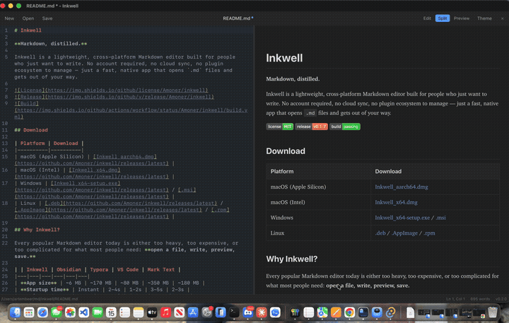
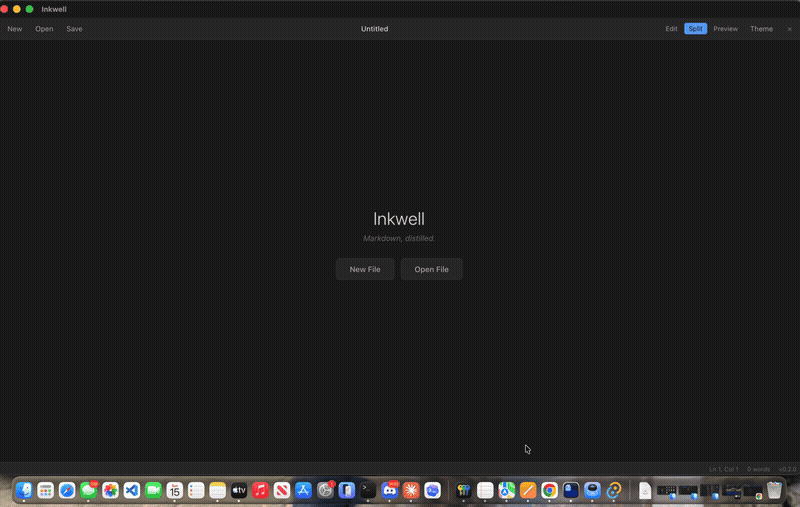
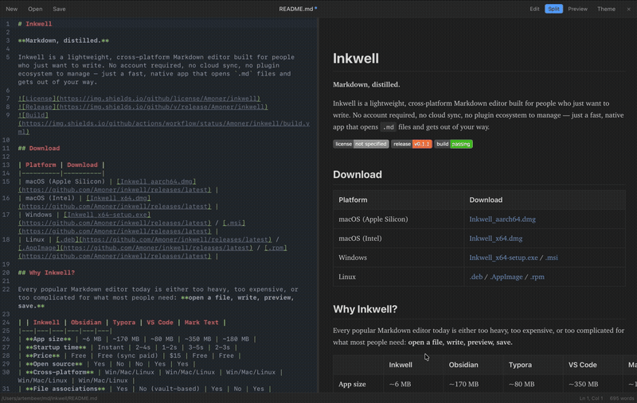

# Inkwell

**Markdown, distilled.**

Inkwell is a lightweight, cross-platform Markdown editor built for people who just want to write. No account required, no cloud sync, no plugin ecosystem to manage — just a fast, native app that opens `.md` files and gets out of your way.


<p align="center">
  
</p>

## Download

| Platform | Download |
|----------|----------|
| macOS (Apple Silicon) | [Inkwell_aarch64.dmg](https://github.com/Amoner/inkwell/releases/latest) |
| macOS (Intel) | [Inkwell_x64.dmg](https://github.com/Amoner/inkwell/releases/latest) |
| Windows | [Inkwell_x64-setup.exe](https://github.com/Amoner/inkwell/releases/latest) / [.msi](https://github.com/Amoner/inkwell/releases/latest) |
| Linux | [.deb](https://github.com/Amoner/inkwell/releases/latest) / [.AppImage](https://github.com/Amoner/inkwell/releases/latest) / [.rpm](https://github.com/Amoner/inkwell/releases/latest) |

## Why Inkwell?

Every popular Markdown editor today is either too heavy, too expensive, or too complicated for what most people need: **open a file, write, preview, save.**

| | Inkwell | Obsidian | Typora | VS Code | Mark Text |
|---|---|---|---|---|---|
| **App size** | ~6 MB | ~170 MB | ~80 MB | ~350 MB | ~180 MB |
| **Startup time** | Instant | 2-4s | 1-2s | 3-5s | 2-3s |
| **Price** | Free | Free (sync paid) | $15 | Free | Free |
| **Open source** | Yes | No | No | Yes | Yes |
| **Cross-platform** | Win/Mac/Linux | Win/Mac/Linux | Win/Mac/Linux | Win/Mac/Linux | Win/Mac/Linux |
| **File associations** | Yes | No (vault-based) | Yes | No | Yes |
| **Live preview** | Split pane | Hybrid editor | Inline WYSIWYG | Extension needed | Inline WYSIWYG |
| **Requires setup** | No | Vault creation | License key | Extensions | No |
| **Native feel** | Yes (system WebView) | Electron | Electron | Electron | Electron |

Inkwell is built with [Tauri](https://tauri.app), which uses your system's native WebView instead of bundling an entire Chromium browser. This is why it's **30x smaller** than Electron-based alternatives while still feeling snappy.

## Features

### Welcome screen


### Split editor + rendered preview


- **Split editor + preview** — Write Markdown on the left, see rendered output on the right. Scroll sync keeps both panes aligned.
- **Syntax highlighting** — Powered by CodeMirror 6 with full Markdown grammar support.
- **Light & dark themes** — Toggle with one click, or follow your system preference.
- **File associations** — Double-click any `.md` file on your system to open it directly in Inkwell.
- **Drag & drop** — Drop a Markdown file onto the window to open it.
- **Live file watching** — If another program edits your file, Inkwell reloads it automatically.
- **Keyboard shortcuts** — `Cmd/Ctrl+S` save, `Cmd/Ctrl+O` open, `Cmd/Ctrl+N` new, `Cmd/Ctrl+B` bold, `Cmd/Ctrl+I` italic, and more.
- **Word count & cursor position** — Always visible in the status bar.
- **Recent files** — Quick access to your last 20 files from the welcome screen.
- **Resizable split pane** — Drag the divider to adjust editor/preview ratio.
- **GFM support** — Tables, task lists, strikethrough, and fenced code blocks render correctly.
- **Responsive layout** — Adapts to narrow windows automatically.

## Building from Source

### Prerequisites

- [Node.js](https://nodejs.org/) 20+
- [Rust](https://rustup.rs/) 1.77+
- Platform-specific dependencies:
  - **Linux**: `libwebkit2gtk-4.1-dev build-essential libssl-dev libayatana-appindicator3-dev librsvg2-dev`
  - **macOS/Windows**: No extra dependencies

### Build

```bash
git clone https://github.com/Amoner/inkwell.git
cd inkwell
npm install
npm run tauri build
```

The compiled app will be in `src-tauri/target/release/bundle/`.

### Development

```bash
npm run tauri dev
```

## Architecture

```
inkwell/
├── src/                    # Frontend (Vite + vanilla JS)
│   ├── editor/             # CodeMirror 6 setup, keymaps, theme
│   ├── preview/            # markdown-it renderer, scroll sync
│   ├── state/              # Observable app state, settings persistence
│   ├── ui/                 # Split pane divider
│   ├── utils/              # Debounce utility
│   ├── styles/             # CSS (variables, layout, themes)
│   └── main.js             # App entry point
├── src-tauri/              # Backend (Rust + Tauri 2.0)
│   ├── src/
│   │   ├── commands/       # IPC commands (file ops, dialogs, recent files)
│   │   ├── platform/       # Desktop-specific code (file watcher)
│   │   └── lib.rs          # App setup and plugin registration
│   └── tauri.conf.json     # Tauri configuration
└── .github/workflows/      # CI/CD for all platforms
```

**Frontend**: Vanilla JavaScript with no framework. CodeMirror 6 handles editing, markdown-it handles rendering, DOMPurify sanitizes preview HTML.

**Backend**: Rust handles file I/O, native dialogs, file watching, and window management through Tauri's IPC bridge.

## License

MIT
